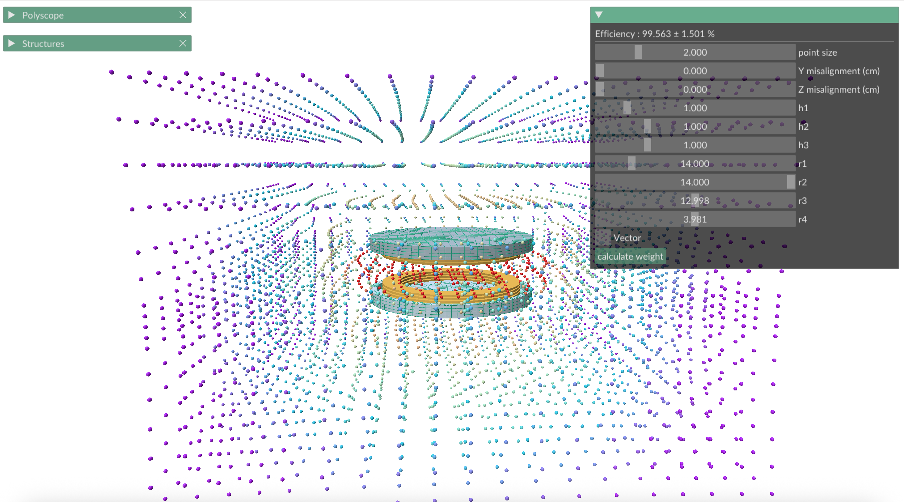
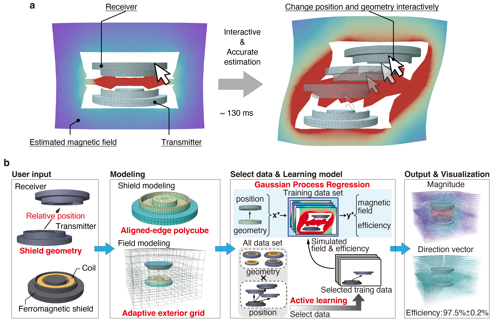
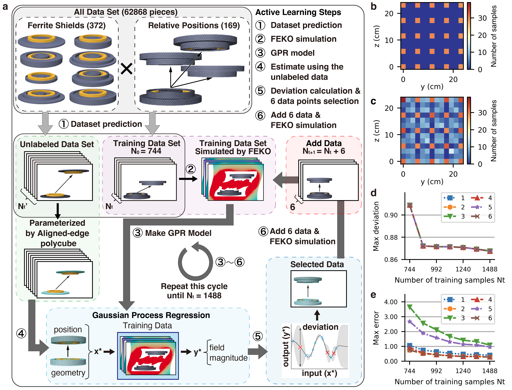
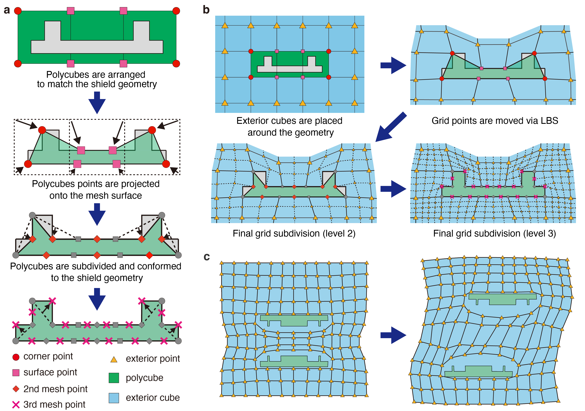
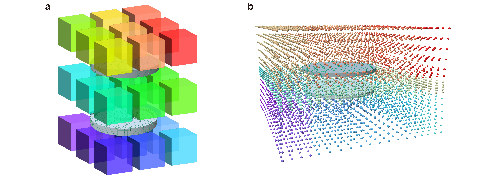
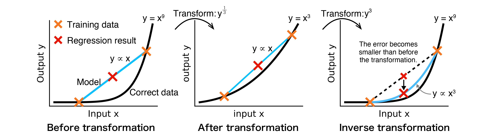

[](https://doi.org/10.5281/zenodo.17378263)

# EMFieldGPR
*Gaussian process regression-based magnetic field estimation for wireless power design*

This repository provides code for the following preprint.

- **Title:** Magnetic field estimation using Gaussian process regression for interactive wireless power system design
- **Authors:** *Yuichi Honjo, Cedric Caremel, Ken Takaki, Yuta Noma, Yoshihiro Kawahara, *Takuya Sasatani
    - (Correspondence: honjo@akg.t.u-tokyo.ac.jp, sasatani@g.ecc.u-tokyo.ac.jp)
- **DOI (preprint):** _Coming soon (to be added when available)_

**Documentation**: https://sasatanilab.github.io/EMFieldGPR/

> **📚 Research Code**: This is academic research code accompanying a paper. No ongoing support, maintenance, or feature development guaranteed.

## Installation

```bash
pip install git+https://github.com/SasataniLab/EMFieldGPR.git
```

## Quick demo

1. After installation, the following command automatically downloads ~255 MB of data and launches an interactive 3D visualization.
```bash
# Run interactive 3D visualization demo
emml demo
```

2. Use the sliders in the right-hand window to change both the shield shape and the coil position.

### Demo interface
This shows the magnetic field and efficiency of the wireless power system.  
The application has three windows:

- **Right window (system geometry & results):** Change coil position and shield shape and see the efficiency. Toggle vectors with the checkbox.
- **Polyscope window:** Adjust visualization mode. Add a plane via **View → Slice Plane → Add Plane**. Switch **Inspect → Color Map** to visualize the magnetic field on that plane. See https://polyscope.run/py/ for details.
- **Structures window:** Toggle visibility and change object colors.



## System Requirements
- Python 3.11+
- OpenGL 3.0+ support
- ~1 GB free space for demo data

-  **Tested with Macbook M4 Pro**

## Jupyter Notebooks for full workflow

- **`OverallFlow.ipynb`**: Complete process reproduction (requires FEKO)
- **`GenerateTestData.ipynb`**: Generate test data for evaluating predictions (requires FEKO)
- **`Figure.ipynb`**: Generate paper figures

## Configuration

The EMFieldML code uses a modular configuration system:

- **Settings:** `EMFieldML.config.settings` — Core parameters (dimensions, prediction points, etc.)
- **Paths:** `EMFieldML.config.paths` — Directory paths for data, models, and outputs
- **Templates:** `EMFieldML.config.templates` — File naming patterns and templates
- **Logging:** `EMFieldML.config.logger` — Logging configuration
- **CADFEKO executable:** Set path in `.env`

## Full Dataset (Optional)

For complete data: https://drive.google.com/drive/folders/1b-hS27wJ5fWXkaZAQSoklPTP_BTxa0lY

Extract `data` and `test_data` to the repository root. Please note that large downloads (over 100 GB) are required.

## Visual Overview

### System Architecture


### Active Learning Process


### PolyCube Mesh Generation


## Technical Details

### Edge Alignment Process


### 27-Point Split Method


### Coordinate Transformation


## Development (Internal)
We **do not guarantee** responses to issues or pull requests.
The contributor instructions below are for **internal use only**.

### Contributor setup

```bash
# Install Poetry
curl -sSL https://install.python-poetry.org | python3 -

# Install dependencies
poetry install

# Run demo
poetry run emml demo

# Run tests
make test
```

### Code Quality

All code must pass these checks before merging. CI runs these on pull requests.

```bash
make format
```

### Documentation

Run `make docs` at the repository root to build HTML documentation in `docs/_build/html/`.  
Documentation is also built and deployed via GitHub Actions.
